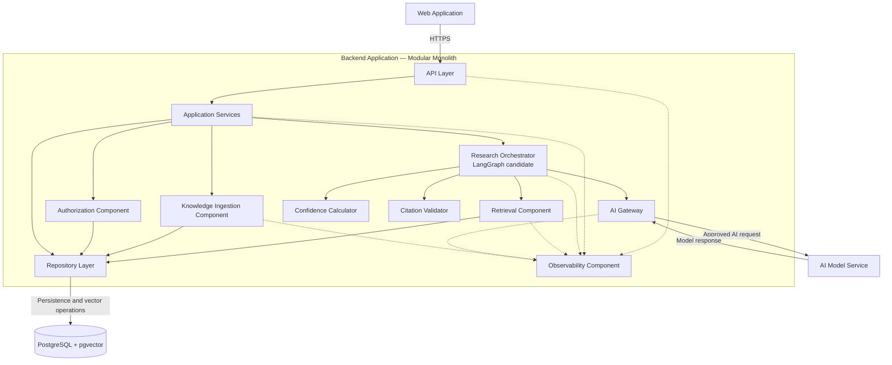
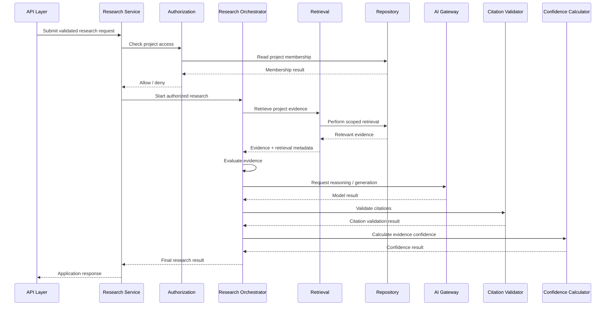

# Enterprise Research Agent — Backend Component Architecture

## 1. Purpose

This document defines the logical component architecture inside the Backend Application of the Enterprise Research Agent.

The goal of this phase is to take the Backend Application identified in the container architecture and decompose it into clear responsibilities without yet committing to detailed code structure, concrete classes, exact API routes, or full LangGraph implementation.

The architecture should make it clear:

- what each backend component owns,
- what each component must not own,
- how components depend on each other,
- where deterministic business logic belongs,
- where AI-driven reasoning belongs,
- where LangGraph fits,
- how storage concerns are isolated, and
- how the design can evolve without turning into a tightly coupled backend.

---

## 2. Component Design Principles

### 2.1 Separate Responsibilities

Each component should have one primary responsibility.

For example:

- the API layer handles HTTP concerns,
- the authorization component handles access decisions,
- the retrieval component finds relevant project information,
- the research orchestrator coordinates research flow,
- the AI gateway communicates with AI providers,
- the repository layer handles database access.

A component should not absorb unrelated responsibilities simply because it is convenient during implementation.

### 2.2 Deterministic Logic Before AI Reasoning

Rules that can be enforced reliably using normal application logic should not be delegated to the language model.

Examples include:

- project authorization,
- request validation,
- project isolation,
- source-ID validation,
- access-control decisions,
- configured evidence thresholds, and
- confidence calculations based on measurable evidence signals.

AI should be used primarily where language understanding, synthesis, semantic interpretation, or open-ended reasoning is required.

### 2.3 Business Logic Should Not Depend Directly on Vendors

Core application logic should not depend directly on a specific:

- LLM provider,
- embedding provider,
- vector database,
- cloud vendor, or
- external AI SDK.

Provider-specific details should be isolated behind clear component boundaries.

### 2.4 Storage Details Should Remain Outside Business Logic

Research and retrieval logic should not contain raw database-specific implementation details throughout the application.

Database access should be isolated through repository or persistence components.

This improves:

- testability,
- maintainability,
- replaceability, and
- separation of concerns.

### 2.5 Orchestration Is Different from Capability

The research orchestrator coordinates the workflow.

It should not directly implement every capability that participates in the workflow.

For example:

```text
Research Orchestrator
        |
        +--> Retrieval Component
        +--> AI Gateway
        +--> Citation Validator
        +--> Confidence Calculator
```

LangGraph, if selected, coordinates these capabilities rather than replacing them.

---

## 3. Component Overview

The initial Backend Application contains the following logical components:

| Component | Primary Responsibility |
|---|---|
| API Layer | Receive external requests and return application responses |
| Application Services | Represent application use cases and coordinate backend operations |
| Authorization Component | Enforce project access and project isolation |
| Research Orchestrator | Coordinate the multi-step research workflow |
| Retrieval Component | Find relevant project evidence |
| AI Gateway | Communicate with AI model providers |
| Confidence Calculator | Calculate evidence-based confidence |
| Citation Validator | Validate source references produced during generation |
| Knowledge Ingestion Component | Process and register project knowledge |
| Repository Layer | Encapsulate database access |
| Observability Component | Record research execution, failures, latency, and trace information |

These components initially remain inside one Backend Application deployment.

---

## 4. API Layer

### Responsibility

The API Layer is the external entry point into the backend.

It handles transport-level concerns such as HTTP requests and responses.

### Responsibilities

The API Layer may:

- receive research requests,
- receive administrative requests,
- validate request structure,
- extract authenticated user information,
- call the appropriate application service,
- translate application errors into HTTP responses, and
- serialize application results.

### Responsibilities It Must Not Own

The API Layer must not directly:

- perform semantic retrieval,
- construct complex AI prompts,
- calculate confidence,
- execute raw SQL,
- determine retrieval strategy,
- perform LangGraph orchestration, or
- make authorization decisions beyond invoking the appropriate authorization logic.

### Example Flow

```text
HTTP Request
    |
    v
API Layer
    |
    v
Application Service
```

The API Layer is the doorway into the application, not the location where business behavior is implemented.

---

## 5. Application Services

### Responsibility

Application Services represent the main use cases supported by the backend.

Examples may include:

```text
ResearchService
KnowledgeManagementService
ProjectAccessService
```

A Research Service may expose a use case conceptually similar to:

```text
research(user, project, question)
```

Its purpose is to coordinate the use case at a high level.

### Responsibilities

Application Services may:

- accept validated application inputs,
- invoke authorization,
- invoke the appropriate workflow,
- coordinate administrative operations,
- manage application-level transaction boundaries, and
- return structured application results.

### Responsibilities They Must Not Own

Application Services should not contain:

- vendor-specific AI SDK calls,
- raw database queries,
- detailed vector-search implementation,
- transport-specific HTTP logic, or
- unrelated low-level infrastructure concerns.

---

## 6. Authorization Component

### Responsibility

The Authorization Component determines whether a user is allowed to perform an action within a project scope.

This is a deterministic application responsibility.

### Example Decision

```text
User
+
Project
+
Requested Action
        |
        v
Authorization Component
        |
      /   \
   ALLOW  DENY
```

### Responsibilities

The Authorization Component may:

- verify project membership,
- verify administrative privileges,
- enforce project-scoped access,
- prevent cross-project information access, and
- expose authorization decisions to higher-level application services.

### Responsibilities It Must Not Own

The Authorization Component must not:

- use an LLM to decide permissions,
- perform research,
- generate answers,
- calculate semantic relevance, or
- rely on prompt instructions for security.

### Important Rule

Restricted information must not become available to the research workflow before authorization has succeeded.

---

## 7. Research Orchestrator

### Responsibility

The Research Orchestrator coordinates the multi-step research workflow.

This is the component where LangGraph is expected to fit if the LangGraph architecture decision is approved.

### Why an Orchestrator Exists

The research process is not necessarily a simple linear function.

The workflow may require:

- multiple steps,
- conditional paths,
- evidence evaluation,
- repeated retrieval,
- conflict handling,
- retries,
- persisted state, and
- future human review.

A simplified workflow is:

```text
Question
   |
   v
Analyze Query
   |
   v
Retrieve Evidence
   |
   v
Evaluate Evidence
   |
   v
Evidence Sufficient?
   |            |
  Yes           No
   |            |
   |       Additional Research
   |            |
   +------------+
   |
   v
Analyze Conflicts
   |
   v
Generate Answer
   |
   v
Validate Citations
   |
   v
Calculate Confidence
   |
   v
Final Result
```

### Responsibilities

The Research Orchestrator may:

- maintain research execution state,
- determine workflow transitions,
- invoke retrieval,
- invoke AI reasoning,
- decide whether additional research is needed,
- coordinate conflict analysis,
- invoke citation validation,
- invoke confidence calculation,
- handle workflow-level retries, and
- produce the final structured research result.

### Responsibilities It Must Not Own

The orchestrator should not directly:

- execute database-specific queries,
- implement vector indexing,
- contain provider-specific AI calls,
- make authorization decisions,
- calculate all retrieval scores itself, or
- implement every supporting capability internally.

### LangGraph Placement

LangGraph is an orchestration mechanism inside this component.

It is not the entire backend architecture.

---

## 8. Retrieval Component

### Responsibility

The Retrieval Component finds project information relevant to the research question.

### Conceptual Interface

```text
retrieve(
    project_scope,
    query,
    retrieval_options
)
```

### Responsibilities

The Retrieval Component may:

- normalize retrieval input,
- create or request query embeddings,
- apply project filters,
- perform semantic search,
- apply metadata filters,
- combine retrieval signals,
- rerank candidates where required,
- return evidence with relevance information, and
- ensure retrieved items remain within the authorized scope supplied to it.

### Responsibilities It Must Not Own

The Retrieval Component must not:

- make user authorization decisions,
- generate the final answer,
- determine HTTP behavior,
- decide business permissions, or
- directly control the overall research workflow.

### Replaceability

The Research Orchestrator should depend on a retrieval capability rather than a specific vector technology.

Conceptually:

```text
Research Orchestrator
        |
        v
Retrieval Component
        |
        v
Repository / Vector Implementation
```

This allows a future migration from:

```text
pgvector
```

to something such as:

```text
Qdrant
Pinecone
Weaviate
Milvus
```

without redesigning the entire research workflow.

---

## 9. AI Gateway

### Responsibility

The AI Gateway is the boundary between application logic and AI model providers.

### Responsibilities

The AI Gateway may handle:

- provider communication,
- model configuration,
- structured model requests,
- prompt dispatch,
- model timeouts,
- provider retries,
- provider-specific error translation,
- token or usage metadata,
- model selection, and
- future provider fallback.

### Conceptual Boundary

```text
Research Orchestrator
        |
        v
AI Gateway
        |
        +--> Provider A
        |
        +--> Provider B
        |
        +--> Local Model
```

The Research Orchestrator should not need to know which provider is being used.

### Responsibilities It Must Not Own

The AI Gateway must not decide:

- project authorization,
- whether a user may see a document,
- final evidence confidence,
- database access rules, or
- project isolation.

---

## 10. Confidence Calculator

### Responsibility

The Confidence Calculator produces an evidence-based confidence result.

The system must not rely on a model statement such as:

```text
"I am 95% confident."
```

as the authoritative confidence value.

### Possible Input Signals

Future confidence logic may consider:

- retrieval relevance,
- evidence coverage,
- number of independent supporting sources,
- source freshness,
- source authority,
- conflicting evidence,
- missing information, and
- citation support.

### Conceptual Flow

```text
Retrieved Evidence
      +
Evidence Metrics
      +
Conflict Information
        |
        v
Confidence Calculator
        |
        v
Confidence Result
```

### Responsibilities It Must Not Own

The Confidence Calculator should not:

- perform authorization,
- perform document retrieval,
- generate the answer, or
- ask the LLM for a self-reported confidence score and return it unchanged.

### Deferred Detail

The exact confidence formula and thresholds are not defined in this phase.

---

## 11. Citation Validator

### Responsibility

The Citation Validator ensures that source references in generated answers correspond to evidence actually available to the research workflow.

### Initial Validation Responsibilities

The Citation Validator may verify:

- whether a cited source exists,
- whether that source was provided to the generation step,
- whether the source belongs to the authorized project scope,
- whether the citation identifier is valid, and
- whether references can be resolved back to stored evidence.

### Future Validation

More advanced versions may validate whether individual claims are genuinely supported by the cited source.

### Important Principle

The system must not blindly trust citation identifiers generated by the language model.

---

## 12. Knowledge Ingestion Component

### Responsibility

The Knowledge Ingestion Component converts approved project documents into a form usable by the research system.

### Conceptual Flow

```text
Uploaded Document
       |
       v
Validate
       |
       v
Extract Text
       |
       v
Normalize
       |
       v
Chunk
       |
       v
Create Embeddings
       |
       v
Persist
```

### Responsibilities

The Knowledge Ingestion Component may:

- validate uploaded documents,
- extract text,
- normalize textual content,
- split documents into chunks,
- create or request embeddings,
- associate metadata,
- track document versions,
- persist processed knowledge, and
- report ingestion status.

### Responsibilities It Must Not Own

The ingestion component should not:

- answer user research questions,
- determine research workflow transitions,
- calculate answer confidence, or
- make project-membership decisions independently.

### Future Evolution

If ingestion becomes long-running or high-volume, this component may later execute through background workers.

---

## 13. Repository Layer

### Responsibility

The Repository Layer encapsulates persistence operations.

It prevents database-specific implementation details from spreading across business components.

### Possible Repositories

Examples may include:

```text
UserRepository
ProjectRepository
MembershipRepository
DocumentRepository
ResearchRunRepository
VectorRepository
```

### Conceptual Dependency

```text
Business / Retrieval Component
            |
            v
       Repository
            |
            v
     PostgreSQL + pgvector
```

### Responsibilities

Repositories may:

- execute database queries,
- map persistence records into application structures,
- store entities,
- retrieve entities,
- perform vector-search persistence operations, and
- manage database-specific query behavior.

### Responsibilities They Must Not Own

Repositories should not:

- decide business authorization rules,
- decide research workflow transitions,
- generate AI answers, or
- contain UI or HTTP logic.

---

## 14. Observability Component

### Responsibility

The Observability Component provides visibility into how research requests are processed.

Enterprise AI systems require more than normal request logging because failures may originate in:

- retrieval,
- evidence quality,
- prompt construction,
- provider behavior,
- source quality,
- authorization, or
- workflow decisions.

### Information That May Be Recorded

A research execution may record:

```text
Research Run
    |
    +--> Question
    +--> Project scope
    +--> Retrieval results
    +--> Retrieval scores
    +--> Workflow transitions
    +--> AI calls
    +--> Retry information
    +--> Latency
    +--> Errors
    +--> Final result
```

Sensitive project information must not be unnecessarily exposed in logs.

### Primary Goal

The system should make it possible to investigate questions such as:

- Was the wrong evidence retrieved?
- Was the evidence too weak?
- Did the workflow take the wrong branch?
- Did the model produce unsupported information?
- Was the source outdated?
- Did the provider fail?
- Was authorization applied correctly?

---

## 15. Backend Component Diagram



---

## 16. Primary Research Component Flow



This sequence is conceptual.

The exact LangGraph node structure is defined in a later phase.

---

## 17. Dependency Rules

### Rule 1

The Web Application depends on the Backend API.

The Web Application must not access the database directly.

### Rule 2

The API Layer depends on Application Services.

The API Layer must not call repositories, vector storage, or AI providers directly for business workflows.

### Rule 3

Application Services may invoke Authorization, Research Orchestration, Knowledge Ingestion, and persistence abstractions as required by the use case.

### Rule 4

The Research Orchestrator depends on capabilities such as Retrieval and AI Gateway.

It must not depend directly on concrete databases or vendor SDKs.

### Rule 5

The Retrieval Component depends on repository or retrieval abstractions.

It should not know about HTTP or user-interface concerns.

### Rule 6

Authorization must occur before restricted project information becomes available to the research workflow.

### Rule 7

The AI Gateway must never become the authorization authority.

### Rule 8

Repositories depend on the database implementation.

Higher-level application and domain logic should not depend directly on database-specific code.

### Rule 9

Observability may observe all major components, but business components should not become tightly coupled to a specific monitoring vendor.

---

## 18. Why LangGraph Belongs in the Research Orchestrator

LangGraph is being considered because the research workflow may require:

- shared workflow state,
- conditional routing,
- repeated retrieval,
- evidence-quality gates,
- retries,
- conflict handling,
- durable execution,
- checkpointing, and
- future human-in-the-loop behavior.

A simple linear flow could be implemented with ordinary Python.

LangGraph becomes justified when research behavior evolves into a stateful workflow with meaningful branching and resumability.

Therefore:

```text
LangGraph
    !=
Entire Backend

LangGraph
    =
Research Orchestration Mechanism
inside the Backend Application
```

This boundary prevents framework-specific concepts from spreading across the entire architecture.

---

## 19. Components That May Become Services Later

### Knowledge Ingestion

May be extracted if:

- ingestion becomes compute-intensive,
- ingestion requires independent scaling,
- large documents require asynchronous workers, or
- ingestion failures must be isolated.

### Retrieval

May be extracted if:

- retrieval requires independent scaling,
- a dedicated vector platform is introduced,
- retrieval traffic grows significantly, or
- multiple applications reuse the retrieval capability.

### AI Gateway

May be extracted if:

- many enterprise applications share centralized model governance,
- model access requires centralized policy enforcement, or
- provider routing becomes a platform capability.

These are future possibilities, not initial requirements.

---

## 20. Deferred Decisions

### API Design

- exact routes,
- request schemas,
- response schemas,
- error contracts,
- API versioning.

### LangGraph

- graph state,
- node definitions,
- conditional edges,
- checkpointing,
- retry policy,
- interrupts,
- human-in-the-loop behavior.

### Retrieval

- embedding model,
- top-k,
- thresholds,
- reranking model,
- hybrid search,
- vector index configuration.

### Confidence

- formula,
- weighting,
- thresholds,
- confidence labels.

### Citation Validation

- exact citation representation,
- claim-level validation,
- source-span validation.

### Repository Implementation

- database schema,
- SQL strategy,
- ORM versus direct SQL,
- transaction strategy.

### Observability

- tracing platform,
- metrics platform,
- log aggregation,
- AI-specific evaluation tooling.

These decisions should be made in later design phases when the relevant trade-offs can be evaluated directly.

---
