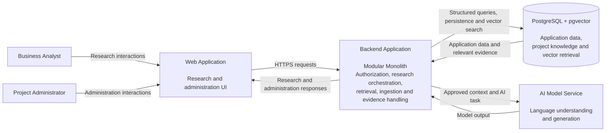
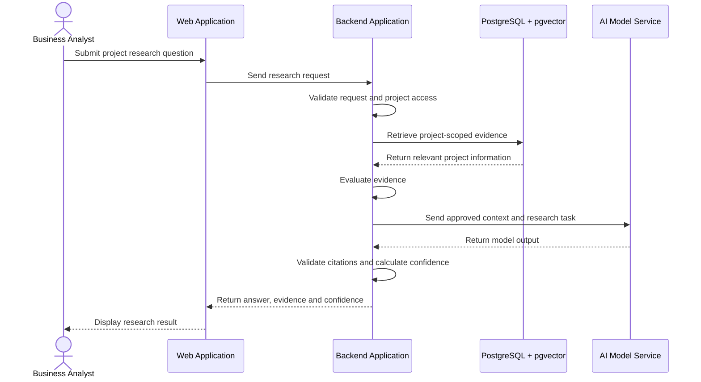
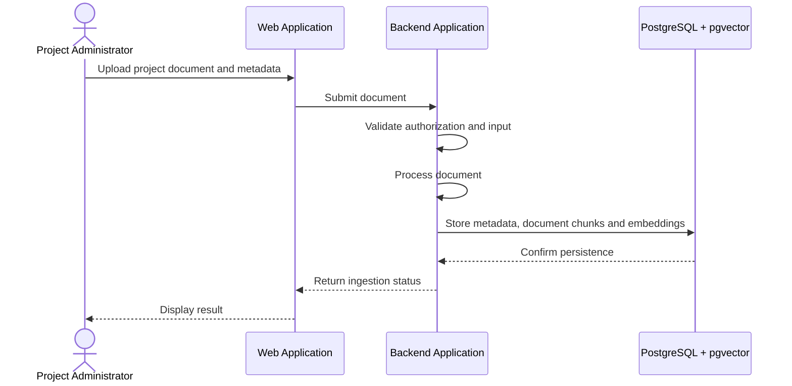

# Enterprise Research Agent — Container Architecture

## 1. Purpose

This document defines the high-level container architecture of the Enterprise Research Agent.

The purpose of this phase is to open the system boundary defined in the System Context view and identify the major runnable applications, data stores, and external dependencies required to implement the first version of the system.

This document intentionally stays above implementation-level details such as internal Python modules, LangGraph node definitions, API routes, database table columns, or concrete deployment infrastructure.

---

## 2. Architecture Style

### Modular Monolith

The initial backend will be designed as a modular monolith.

This means the application is deployed as a single backend application, while internal responsibilities are separated into clear modules such as:

- API handling
- authorization
- research orchestration
- document ingestion
- retrieval
- AI model communication
- citation handling
- confidence calculation
- persistence

These responsibilities remain logically separated without being deployed as independent microservices.

### Why This Approach

The initial system does not yet have requirements that justify independent deployment of multiple backend services.

Using a modular monolith reduces:

- operational complexity,
- network communication between internal modules,
- deployment overhead,
- distributed tracing complexity,
- service-version coordination, and
- infrastructure cost.

The architecture should still maintain clear module boundaries so that specific capabilities can be extracted into independently deployable services later if requirements justify doing so.

Typical reasons for future service extraction may include:

- independent scaling requirements,
- independent deployment frequency,
- strong fault-isolation needs,
- separate team ownership, or
- significantly different runtime requirements.

---

## 3. Container Overview

The initial Enterprise Research Agent consists of the following major containers and external dependencies:

| Container / System | Type | Primary Responsibility |
|---|---|---|
| Web Application | Application | User-facing research and administration interface |
| Backend Application | Application | Business logic, authorization, research orchestration, retrieval, ingestion, evidence handling, and AI coordination |
| PostgreSQL + pgvector | Data Store | Structured application data and semantic vector retrieval |
| AI Model Service | External System | Language understanding and generation |

The first version intentionally does not introduce additional infrastructure such as a dedicated message queue, cache, background-worker platform, or separate vector database unless later requirements justify them.

---

## 4. Web Application

### Responsibility

The Web Application provides the user-facing interface for Business Analysts and Project Administrators.

### Business Analyst Capabilities

The Web Application allows Business Analysts to:

- submit project-scoped research questions,
- view generated research answers,
- inspect supporting evidence,
- inspect source references,
- view confidence indications,
- view conflicting-information warnings, and
- view insufficient-evidence responses.

### Project Administrator Capabilities

The Web Application allows Project Administrators to:

- upload project documents,
- provide document metadata,
- review document status,
- manage project membership,
- grant project access, and
- revoke project access.

### Responsibilities Owned by the Web Application

The Web Application owns:

- presentation,
- user interaction,
- client-side form validation,
- displaying system responses, and
- initiating requests to the Backend Application.

### Responsibilities Not Owned by the Web Application

The Web Application must not be responsible for:

- final authorization decisions,
- project data isolation,
- evidence-quality evaluation,
- AI prompt construction,
- retrieval strategy,
- confidence calculation,
- direct database access, or
- direct AI provider access.

Security-critical decisions must remain under server-side control.

---

## 5. Backend Application

### Responsibility

The Backend Application is the central application container of the Enterprise Research Agent.

It receives requests from the Web Application and coordinates the business rules required to process research and administrative operations.

### Core Responsibilities

The Backend Application is responsible for:

- request validation,
- authentication integration,
- project authorization,
- project data isolation,
- research request orchestration,
- project knowledge retrieval,
- evidence-quality evaluation,
- additional research attempts,
- conflict handling,
- grounded-answer generation,
- citation validation,
- evidence-based confidence calculation,
- document ingestion,
- document metadata management,
- project membership management,
- persistence,
- error handling,
- logging and research execution tracing.

### Internal Design Direction

Although the Backend Application is deployed as one application in the initial version, it should internally maintain clear responsibilities.

Possible future internal modules may include:

- API module
- authorization module
- research module
- retrieval module
- ingestion module
- AI gateway module
- confidence module
- persistence module
- observability module

The exact component structure is deferred to the next architecture phase.

### LangGraph Placement

If LangGraph is selected for research orchestration, it will initially run inside the Backend Application.

LangGraph is therefore not represented as an independent container in this diagram.

The graph may coordinate activities such as:

- query analysis,
- evidence retrieval,
- evidence evaluation,
- conditional additional research,
- conflict handling,
- answer generation,
- citation validation, and
- confidence calculation.

The decision to use LangGraph and the exact graph structure will be documented separately as an architectural decision.

---

## 6. Data Store — PostgreSQL + pgvector

### Responsibility

The initial architecture uses PostgreSQL as the primary application database.

The pgvector extension is proposed to provide vector-similarity search capabilities within the same database technology.

### Structured Data Responsibilities

PostgreSQL may store information such as:

- users,
- projects,
- project memberships,
- document metadata,
- document versions,
- document chunks,
- research runs,
- citations,
- execution metadata, and
- future user feedback.

### Vector Retrieval Responsibilities

pgvector may store embeddings associated with project document chunks.

These embeddings allow the system to search for semantically relevant information rather than relying only on exact keyword matches.

A simplified relationship is:

```text
Project Document
       ↓
Document Version
       ↓
Document Chunks
       ↓
Embeddings
       ↓
Semantic Retrieval
```

### Why PostgreSQL + pgvector Is a Strong Initial Option

The application already requires relational storage for structured business data.

Using pgvector allows the initial system to support both:

- relational application data, and
- vector similarity search

without operating a separate vector database.

This reduces infrastructure and operational complexity during the initial phase.

### Decision Is Not Permanent

PostgreSQL + pgvector is an architectural choice to be formally evaluated in an Architecture Decision Record.

A dedicated vector database may become preferable if future requirements introduce:

- substantially larger vector datasets,
- specialized vector indexing requirements,
- independent scaling of vector workloads,
- high-throughput retrieval requirements,
- advanced hybrid-search capabilities, or
- operational reasons to isolate vector search from transactional storage.

---

## 7. AI Model Service

### Responsibility

The AI Model Service provides language understanding and generation capabilities requested by the Backend Application.

The exact provider or hosting model is intentionally not defined in this phase.

Possible implementations may include:

- managed external AI providers,
- enterprise cloud AI services,
- private hosted models, or
- locally hosted models.

### Interaction Boundary

The Backend Application must control what information is sent to the AI Model Service.

The AI Model Service must not directly access the application database or independently determine which project information a user is allowed to see.

A simplified flow is:

```text
User Question
      ↓
Backend Authorization
      ↓
Approved Project Scope
      ↓
Relevant Evidence
      ↓
AI Model Service
```

### Responsibilities Not Owned by the AI Model Service

The model must not be treated as responsible for:

- authorization,
- access control,
- project isolation,
- identifying authoritative enterprise sources,
- final confidence calculation,
- enforcing deterministic business rules, or
- deciding whether protected information may be disclosed.

---

## 8. C4 Container Diagram



### Diagram Interpretation

The Web Application handles user interaction.

The Backend Application owns application and research logic.

PostgreSQL + pgvector stores structured application data and project knowledge while supporting semantic retrieval.

The AI Model Service provides reasoning and generation capabilities but does not control authorization, project isolation, or evidence policy.

LangGraph is intentionally not shown as a separate container because it is expected to run as part of the Backend Application rather than as an independently deployed system in the first version.

---

## 9. Primary Research Flow

The primary research flow at the container level is:



### Important Principle

The AI Model Service does not receive unrestricted enterprise data.

The Backend Application first establishes the authorized project scope and determines what evidence may be used.

---

## 10. Knowledge Ingestion Flow

The initial knowledge-ingestion flow is intentionally simple.



The internal document-processing stages may later include:

```text
Validate
   ↓
Extract Text
   ↓
Normalize
   ↓
Chunk
   ↓
Create Embeddings
   ↓
Persist
```

The exact ingestion component structure is deferred to the component-design phase.

---

## 11. Why No Background Worker Yet?

Document processing can become computationally expensive for large files or large upload volumes.

A future architecture may introduce:

```text
Web Application
       ↓
Backend Application
       ↓
Job Queue
       ↓
Background Worker
       ↓
Database
```

However, the initial architecture does not introduce a queue and worker solely because enterprise systems commonly use them.

The first version may process supported document sizes synchronously if the observed latency and workload remain acceptable.

A background worker should be introduced when requirements demonstrate a need for:

- long-running ingestion,
- higher upload throughput,
- retryable asynchronous processing,
- independent ingestion scaling,
- workload isolation, or
- stronger failure recovery.

---

## 12. Why No Cache Yet?

The initial architecture does not include Redis or another dedicated cache.

Caching should be introduced only when there is a demonstrated need such as:

- repeated expensive queries,
- high read traffic,
- model-result reuse,
- expensive authorization lookups,
- rate limiting, or
- performance bottlenecks confirmed through observation.

Adding caching before understanding access patterns would increase complexity without a proven benefit.

---

## 13. Why No Separate Vector Database Yet?

A dedicated vector database is not required for the initial design because PostgreSQL is already required for application data and pgvector can support the first semantic-retrieval use cases.

This avoids introducing another operational dependency.

A separate vector database may be reconsidered if:

- vector workloads need to scale independently,
- retrieval volume becomes significantly larger,
- specialized vector features become necessary,
- hybrid search requirements exceed the selected PostgreSQL implementation, or
- vector workload isolation becomes operationally beneficial.

---

## 14. Why No Microservices Yet?

The initial system has a limited number of users, a bounded project-research scope, and no demonstrated requirement for independent service deployment.

Separating every capability into a microservice would introduce distributed-system costs such as:

- network failures,
- service discovery,
- independent deployment pipelines,
- distributed tracing,
- service-version compatibility,
- more complex local development,
- additional monitoring, and
- higher infrastructure overhead.

Therefore, responsibilities are separated through internal module boundaries first.

A module should only be considered for service extraction when there is a clear business or technical reason.

---

## 15. Scaling Considerations

The initial architecture should be able to evolve without redesigning the entire system.

### Growth in Documents

If project data increases substantially, possible changes may include:

- improved vector indexes,
- batch embedding,
- asynchronous ingestion,
- retrieval reranking,
- query optimization,
- partitioning strategies, or
- dedicated vector infrastructure.

### Growth in Users

If research traffic grows, possible changes may include:

- multiple backend instances,
- load balancing,
- connection-pool tuning,
- caching,
- request throttling, and
- independent processing workers.

### Growth in Projects

Project scope and authorization must remain explicit as the system expands.

The architecture should allow:

```text
Organization
    │
    ├── Project A
    ├── Project B
    ├── Project C
    └── ...
```

while preventing accidental cross-project retrieval.

### Growth in Integrations

Future knowledge sources such as Jira, GitHub, Confluence, or other enterprise tools should be introduced through clear integration boundaries rather than embedding vendor-specific logic throughout the research workflow.

---

## 16. Deferred Architecture Decisions

The following decisions remain intentionally deferred.

### Backend Technology

- FastAPI or another API framework
- Python application structure
- internal module contracts

### Research Orchestration

- LangGraph adoption
- graph-state definition
- graph nodes
- conditional transitions
- retry strategy
- checkpointing

### Retrieval

- embedding model
- chunk size and overlap
- similarity metric
- retrieval top-k
- reranking
- hybrid retrieval

### Data

- detailed relational schema
- vector-index configuration
- research-history retention
- document-storage approach

### AI Provider

- specific LLM vendor
- specific model
- local versus hosted inference
- provider fallback strategy

### Infrastructure

- cloud provider
- deployment service
- background-worker technology
- message queue
- cache
- observability stack

These decisions will be addressed when lower-level architectural requirements make the trade-offs clearer.

---
