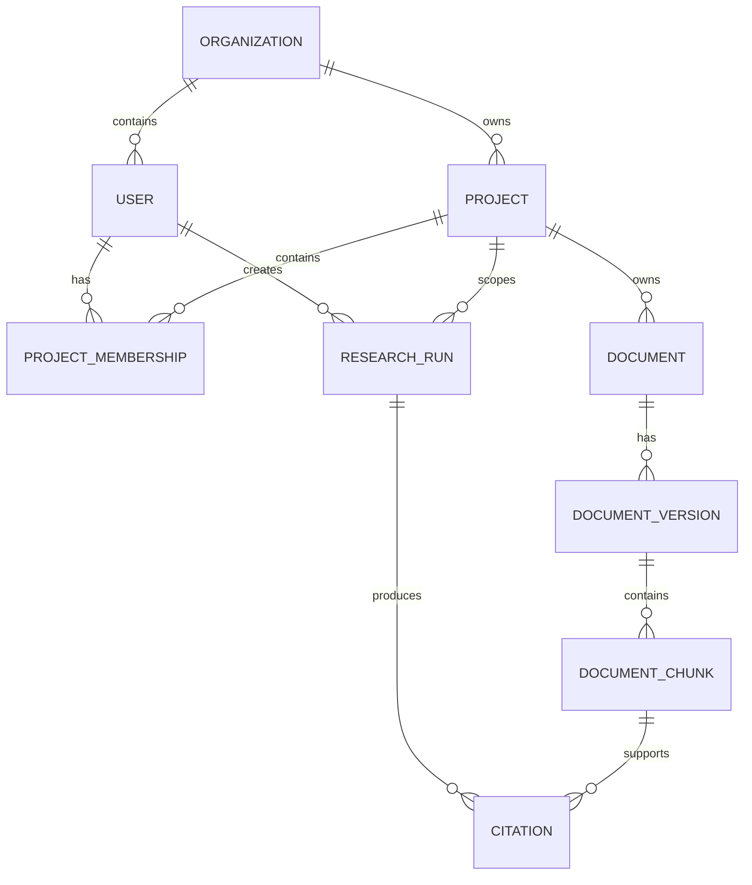

# Enterprise Research Agent — Data Architecture

## 1. Purpose

This document defines the conceptual data architecture for the Enterprise Research Agent.

It explains:
- what business data is stored,
- what belongs to LangGraph execution state,
- how project isolation is enforced,
- how document versions and chunks are represented,
- how citations remain traceable to source evidence,
- and which data decisions are deferred until implementation.

This is not the final SQL schema.

---

## 2. Data Design Principles

### 2.1 Project scope must be explicit

Every project-specific resource must have a clear relationship back to the project that owns it.

```text
Project
 ├── Memberships
 ├── Documents
 └── Research Runs
```

A request scoped to Project Alpha must not retrieve Project Beta data.

### 2.2 Authorization is deterministic

Permissions are represented as normal application data.

```text
User + Project
      ↓
Project Membership
      ↓
ALLOW / DENY
```

The LLM must never decide whether a user can access a project.

### 2.3 Source traceability must be preserved

Every evidence-based answer should be traceable through:

```text
Answer
  ↓
Citation
  ↓
Document Chunk
  ↓
Document Version
  ↓
Document
  ↓
Project
```

### 2.4 Document versions matter

The system should distinguish current, superseded, and archived versions of documents.

### 2.5 Workflow state is different from business data

Long-lived application entities and temporary LangGraph state are separate concerns.

### 2.6 Embeddings are derived but valuable data

Embeddings can be regenerated, but regeneration may be expensive. They should normally be persisted together with metadata describing the embedding model used.

---

## 3. Data Categories

### 3.1 Business Data

Examples:
- Organization
- User
- Project
- Project Membership
- Document
- Document Version
- Document Chunk
- Research Run
- Citation

### 3.2 Workflow Execution Data

Examples:
- current search queries
- retrieved evidence
- retrieval metrics
- research attempts
- conflicts
- draft answer
- citation validation
- current graph position

### 3.3 Operational and Audit Data

Examples:
- workflow transitions
- node latency
- model latency
- retrieval latency
- token usage
- retries
- errors
- final status

---

## 4. Core Data Model

```text
Organization
   ├── Users
   └── Projects
        ├── Project Memberships
        ├── Documents
        │    └── Document Versions
        │         └── Document Chunks
        │              └── Embeddings
        └── Research Runs
             └── Citations
                  └── Document Chunk
```

---

## 5. Organization

Represents the enterprise or tenant that owns users and projects.

Conceptual fields:

```text
organization_id
name
status
created_at
```

Even if V1 uses one organization, keeping this concept makes future multi-tenant growth easier.

---

## 6. User

Represents a person who can use the system.

Conceptual fields:

```text
user_id
organization_id
email
name
status
created_at
updated_at
```

A user should not contain a single `project_id` because one user may belong to multiple projects.

---

## 7. Project

Represents the primary research and authorization boundary.

Conceptual fields:

```text
project_id
organization_id
name
description
status
created_at
updated_at
```

A project groups:
- members,
- documents,
- research runs,
- project-scoped knowledge.

---

## 8. Project Membership

Represents the many-to-many relationship between users and projects.

Conceptual fields:

```text
membership_id
user_id
project_id
role
status
created_at
```

Possible roles:

```text
MEMBER
ADMIN
```

Example authorization check:

```text
user_id + project_id
       ↓
membership exists?
    /            \
  yes            no
   ↓              ↓
ALLOW            DENY
```

---

## 9. Document

Represents a logical project document, for example:

```text
Payment Requirements
```

Conceptual fields:

```text
document_id
project_id
name
document_type
source
status
created_at
updated_at
```

Possible document types:
- requirements
- meeting notes
- status report
- release notes
- change request
- technical documentation

---

## 10. Document Version

Represents a particular version of a logical document.

```text
Payment Requirements
 ├── v1
 ├── v2
 └── v3
```

Conceptual fields:

```text
document_version_id
document_id
version_number
source_date
ingested_at
status
checksum
storage_reference
```

Possible status values:

```text
CURRENT
SUPERSEDED
ARCHIVED
```

Versioning matters because old and new documents can otherwise appear to contain conflicting facts.

---

## 11. Document Chunk

Represents a smaller retrievable section of a document version.

Conceptual fields:

```text
chunk_id
document_version_id
content
chunk_index
page_number
section
metadata
created_at
```

The chunk should retain enough source-location metadata to support citations such as:

```text
Requirements v3
Page 42
Section 7.2
```

---

## 12. Embedding

Represents the semantic vector associated with a document chunk.

```text
Document Chunk
      ↓
Embedding Model
      ↓
[0.14, -0.27, 0.81, ...]
```

With PostgreSQL + pgvector, the vector may be stored directly on the chunk record rather than in a separate table.

Useful embedding metadata includes:

```text
embedding_model
embedding_model_version
embedding_dimension
embedded_at
```

If the embedding model changes, affected chunks may need to be re-embedded.

---

## 13. Research Run

Represents one execution of a research request.

Conceptual fields:

```text
research_run_id
user_id
project_id
question
status
started_at
completed_at
final_answer
confidence_score
confidence_label
outcome
```

Possible statuses:

```text
RUNNING
COMPLETED
INSUFFICIENT_EVIDENCE
FAILED
```

Research runs support:
- debugging,
- auditability,
- evaluation,
- user history,
- performance analysis.

---

## 14. Citation

Connects a research answer to the source evidence that supports it.

Conceptual fields:

```text
citation_id
research_run_id
chunk_id
citation_label
claim_reference
created_at
```

Traceability becomes:

```text
Research Run
   ↓
Citation
   ↓
Document Chunk
   ↓
Document Version
   ↓
Document
   ↓
Project
```

---

## 15. Entity Relationship Diagram



This diagram focuses on relationships rather than every future SQL column.

---

## 16. Project Isolation

Project isolation is both a security and retrieval requirement.

Preferred flow:

```text
User
 ↓
Authorization
 ↓
Authorized Project
 ↓
Project-Scoped Retrieval
 ↓
Relevant Evidence
```

Bad approach:

```text
Search all vectors
 ↓
Take top results
 ↓
Remove unauthorized results
```

Better approach:

```text
Apply project scope first
 ↓
Perform vector retrieval inside that scope
```

This improves both security and efficiency.

---

## 17. Version-Aware Retrieval

Normal research should generally prefer current documents.

```text
Project Scope
 ↓
Current Document Versions
 ↓
Semantic Search
```

Historical versions should be considered when the user explicitly asks about earlier behavior or changes over time.

Example:

```text
"What is the current payment timeout?"
→ prefer CURRENT versions

"What was the timeout before the June change?"
→ include relevant SUPERSEDED versions
```

---

## 18. Data Lineage

Data lineage means being able to answer:

> Where did this conclusion come from?

The desired lineage is:

```text
Final Answer
 ↓
Citation
 ↓
Document Chunk
 ↓
Document Version
 ↓
Document
 ↓
Project
```

This supports:
- explainability,
- source verification,
- debugging,
- auditing.

---

## 19. LangGraph Checkpoint Data

LangGraph execution state is different from business data.

Example workflow state:

```text
research_intent
search_queries
current_evidence
research_attempts
conflicts
draft_answer
citation_validation
current_graph_position
```

Checkpoint persistence may support:
- retry after application failure,
- resume after interruption,
- debugging,
- workflow inspection,
- future human-in-the-loop approval.

Conceptually:

```text
PostgreSQL
 ├── Application Data
 │    ├── users
 │    ├── projects
 │    ├── documents
 │    └── research_runs
 │
 └── LangGraph Checkpoint Data
      ├── workflow state
      └── graph checkpoints
```

The same database technology may hold both, but they serve different purposes.

---

## 20. Original File Storage

Original uploaded files do not necessarily need to live inside PostgreSQL.

Long-term:

```text
Original Files
    ↓
File / Object Storage

Metadata + Parsed Text
    ↓
PostgreSQL
```

For V1, local file storage may be sufficient.

The application should use a storage abstraction so that local storage can later be replaced by object storage without changing research logic.

---

## 21. Data Retention

| Data | Retention Direction | Reason |
|---|---|---|
| User | Long-lived | Identity |
| Project | Long-lived | Business entity |
| Project Membership | Long-lived / audit-based | Authorization |
| Document metadata | Long-lived | Knowledge management |
| Document versions | Long-lived | History and traceability |
| Document chunks | Long-lived | Retrieval |
| Embeddings | Long-lived | Expensive derived data |
| Research question | Retention-based | Audit and evaluation |
| Final answer | Retention-based | History and audit |
| Citations | Retention-based | Explainability |
| Retrieval results | Optional | Debugging/evaluation |
| Search reformulations | Optional | Workflow debugging |
| Draft answer | Usually temporary | Intermediate state |
| LangGraph checkpoints | Temporary / retention-based | Resume/debugging |
| Logs and traces | Retention-based | Operations |

Exact retention periods depend on enterprise policy.

---

## 22. Embedding Versioning

The system should know which embedding model produced each vector.

Useful metadata:

```text
model
model version
dimension
generation date
```

If the model changes:

```text
Existing Chunks
      ↓
Re-embed with New Model
      ↓
Replace or version vectors
```

This prevents incompatible embeddings from being silently mixed.

---

## 23. Persistent vs Temporary Data

### Persistent Business Data

```text
Organization
User
Project
Membership
Document
Document Version
Document Chunk
Embedding
Research Run
Citation
```

### Temporary Workflow Data

```text
current search queries
current retrieval candidates
research attempt count
temporary conflict analysis
draft answer
current graph position
```

### Operational Data

```text
logs
traces
latency
errors
token usage
workflow transitions
```

---

## 24. Why Data Architecture Affects AI Quality

Poor data design can directly produce poor AI answers.

### Example: bad version management

```text
current requirement
+
superseded requirement
```

may look like conflicting evidence.

### Example: bad project isolation

```text
Project A question
+
Project B retrieval result
```

creates both a security problem and an incorrect answer.

### Example: missing source metadata

The answer cannot be properly verified.

### Example: missing embedding model metadata

A model upgrade may leave incompatible vectors mixed together.

Therefore data architecture is part of AI reliability, not only database design.

---

## 25. Deferred Decisions

### Database
- exact table names
- key types
- indexes
- constraints
- migration framework
- ORM versus direct SQL

### Multi-Tenancy
- shared schema versus schema-per-tenant
- tenant-isolation implementation

### Authorization
- detailed role hierarchy
- permission model

### Document Storage
- local filesystem versus object storage
- encryption strategy
- storage naming

### Chunking
- chunk size
- overlap
- structure-aware chunking

### Embeddings
- model
- dimension
- migration/re-embedding process

### Research History
- retention period
- deletion rules
- user-visible history

### LangGraph
- checkpointer implementation
- checkpoint retention
- persisted state fields

### Observability
- trace storage
- audit event format
- log retention
- sensitive-data masking

---
