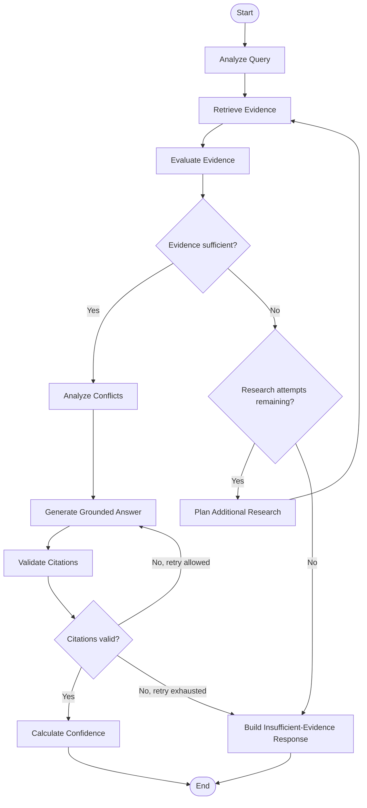

# Enterprise Research Agent — LangGraph Workflow Architecture

## 1. Purpose

This document defines the LangGraph workflow architecture for the Enterprise Research Agent.

The goal of this phase is to design how an authorized research request moves through a stateful research workflow, including:

- query understanding,
- evidence retrieval,
- evidence evaluation,
- conditional additional research,
- conflict analysis,
- grounded answer generation,
- citation validation,
- confidence calculation,
- failure handling,
- retry limits, and
- workflow termination.

This document focuses on orchestration and state design.

It intentionally does not define:

- exact Python code,
- final prompts,
- concrete database queries,
- exact retrieval thresholds,
- final confidence formulas, or
- production deployment details.

---

## 2. Why LangGraph

A simple research workflow could be implemented as ordinary Python:

```text
Question
   |
   v
Retrieve
   |
   v
Generate
   |
   v
Answer
```

That would not justify LangGraph.

The Enterprise Research Agent requires a more complex workflow.

The system may need to:

- maintain shared state,
- make conditional decisions,
- repeat retrieval with revised searches,
- stop when evidence remains insufficient,
- detect conflicting information,
- retry selected operations,
- preserve execution state,
- support future human review, and
- expose an explainable execution path.

These requirements make a graph-based workflow appropriate.

LangGraph is therefore considered specifically for the research orchestration layer.

It is not the architecture of the entire backend.

---

## 3. Why Not a Simple Chain

A simple sequential chain assumes that every request follows the same fixed path.

Example:

```text
Analyze
   |
   v
Retrieve
   |
   v
Generate
   |
   v
Return
```

However, the research workflow may need different paths.

Example:

```text
Retrieve
   |
   v
Evaluate Evidence
   |
   v
Evidence Sufficient?
    /          \
  Yes           No
   |             |
   |             v
   |       Plan More Research
   |             |
   |             v
   |        Retrieve Again
   |             |
   +-------------+
```

The presence of:

- branching,
- loops,
- state,
- retry conditions,
- termination rules, and
- future interruption/resume behavior

makes a graph more suitable than a fixed chain.

---

## 4. Research Workflow Overview

The initial research workflow is:



---

## 5. Research State

The workflow requires shared state that can be read and updated by different nodes.

A conceptual state model is:

```text
ResearchState

request_id
user_id
project_id
question

research_intent
search_queries

evidence
retrieval_metrics

research_attempts
max_research_attempts

evidence_status

conflicts

draft_answer

citations
citation_validation

confidence

errors
```

The exact implementation type is deferred.

---

## 6. Research State Fields

### 6.1 Request Identity

#### request_id

Purpose:

Uniquely identifies the research execution.

Written by:

Application layer before graph execution.

Read by:

Observability and persistence components.

---

### 6.2 User Identity

#### user_id

Purpose:

Identifies the user who initiated the request.

Important:

Authorization is performed before restricted project information becomes available to the graph.

The graph should not independently infer or modify user authorization.

---

### 6.3 Project Scope

#### project_id

Purpose:

Defines the authorized project scope of the research request.

This value must originate from deterministic application logic.

The LLM must not choose or expand the authorized project scope.

---

### 6.4 Question

#### question

Purpose:

Stores the original natural-language research question.

Example:

```text
Why was the July release delayed?
```

---

### 6.5 Research Intent

#### research_intent

Purpose:

Stores the interpreted purpose of the question.

Example:

```text
Investigate causes of the July release delay.
```

Typically written by:

Analyze Query node.

---

### 6.6 Search Queries

#### search_queries

Purpose:

Contains one or more search expressions used by the Retrieval Component.

Example:

```text
- July release delay
- UAT blocker July
- release defect July
- client approval delay
```

Initially produced by:

Analyze Query.

Potentially updated by:

Plan Additional Research.

---

### 6.7 Evidence

#### evidence

Purpose:

Stores the currently available evidence selected by the retrieval workflow.

Each evidence item should retain source metadata such as:

- source identifier,
- document identifier,
- document version,
- project identifier,
- text passage,
- relevance score,
- source date, where available,
- retrieval metadata.

---

### 6.8 Retrieval Metrics

#### retrieval_metrics

Purpose:

Stores measurable information about retrieval quality.

Possible values may include:

- top relevance score,
- average relevance score,
- number of retrieved results,
- number of unique sources,
- retrieval latency,
- source freshness indicators.

These metrics may be used by evidence evaluation and confidence calculation.

---

### 6.9 Research Attempts

#### research_attempts

Purpose:

Counts how many additional research attempts have occurred.

This prevents unbounded research loops.

---

### 6.10 Maximum Research Attempts

#### max_research_attempts

Purpose:

Defines the deterministic maximum number of additional research cycles permitted for one request.

The exact default value is deferred to implementation and evaluation.

---

### 6.11 Evidence Status

#### evidence_status

Possible conceptual values:

```text
SUFFICIENT
INSUFFICIENT
PARTIAL
CONFLICTING
```

Purpose:

Represents the current state of available evidence.

---

### 6.12 Conflicts

#### conflicts

Purpose:

Stores identified disagreements between relevant evidence sources.

Example:

```text
Source A:
Delay caused by UAT approval.

Source B:
Delay caused by external API dependency.
```

This does not automatically mean either source is incorrect.

The final response may present both as contributing or conflicting evidence.

---

### 6.13 Draft Answer

#### draft_answer

Purpose:

Stores the current model-generated answer before final validation.

---

### 6.14 Citations

#### citations

Purpose:

Stores the source references associated with the generated answer.

Citations must be resolvable back to evidence that was actually available to the workflow.

---

### 6.15 Citation Validation

#### citation_validation

Purpose:

Stores the result of citation validation.

Possible conceptual values:

```text
VALID
INVALID
PARTIAL
```

---

### 6.16 Confidence

#### confidence

Purpose:

Stores the final evidence-based confidence result.

The exact representation may later include:

```text
score
label
reason
```

Example:

```text
score: 0.82
label: HIGH
reason: Strong evidence from multiple current sources.
```

---

### 6.17 Errors

#### errors

Purpose:

Stores workflow-level error information required for debugging and controlled recovery.

Sensitive internal information must not be unnecessarily exposed to end users.

---

## 7. State Ownership Rules

Each state field should have a clear owner.

| State Field | Primary Writer | Primary Readers |
|---|---|---|
| request_id | Application Service | Observability, persistence |
| user_id | Application Service | Audit / observability |
| project_id | Application Service | Retrieval, audit |
| question | Application Service | Analyze Query, Generation |
| research_intent | Analyze Query | Retrieval, Additional Research |
| search_queries | Analyze Query / Plan Additional Research | Retrieval |
| evidence | Retrieve Evidence | Evaluation, Conflict, Generation, Confidence |
| retrieval_metrics | Retrieve Evidence | Evaluation, Confidence |
| research_attempts | Additional Research control | Routing |
| evidence_status | Evaluate Evidence | Routing, Generation |
| conflicts | Analyze Conflicts | Generation, Confidence |
| draft_answer | Generate Answer | Citation Validator |
| citations | Generate Answer | Citation Validator |
| citation_validation | Citation Validator | Routing, Confidence |
| confidence | Confidence Calculator | Final response |
| errors | Any failing node | Observability, error handling |

---

## 8. Node Definitions

## 8.1 Analyze Query

### Purpose

Interpret the user's natural-language question and prepare a research plan suitable for retrieval.

### Input

- question
- project scope

### Output

- research intent
- search queries
- optional non-security retrieval hints

### Example

Input:

```text
What changed after the last client review?
```

Output:

```text
Intent:
Identify project changes after the most recent client review.

Search concepts:
- client review
- change request
- requirement update
- action item
- decision
```

### Node Type

AI-driven.

### Why AI

The task involves natural-language interpretation and semantic reasoning.

### Must Not Do

The node must not:

- grant access,
- choose unauthorized projects,
- bypass project scope,
- decide whether sensitive data may be disclosed.

---

## 8.2 Retrieve Evidence

### Purpose

Retrieve project-scoped evidence relevant to the current search plan.

### Input

- project_id
- search_queries
- retrieval options

### Output

- evidence
- retrieval metrics

### Node Type

Deterministic/tool node.

### Implementation Boundary

The node calls the Retrieval Component.

Conceptually:

```text
LangGraph Node
     |
     v
Retrieval Component
     |
     v
Repository / Vector Search
```

The LangGraph node must not contain database-specific SQL.

---

## 8.3 Evaluate Evidence

### Purpose

Determine whether the retrieved evidence is sufficient to continue toward answer generation.

### Inputs

- evidence
- retrieval metrics
- original question
- research intent

### Possible Outputs

```text
SUFFICIENT
INSUFFICIENT
PARTIAL
```

### Node Type

Hybrid.

### Deterministic Evaluation

Possible deterministic checks may include:

- minimum number of relevant results,
- top retrieval score,
- configured relevance threshold,
- number of unique sources,
- whether evidence belongs to the authorized project.

### AI-Assisted Evaluation

AI may later help determine:

- whether retrieved evidence covers all parts of a complex question,
- whether information is semantically incomplete,
- whether important research dimensions remain unresolved.

### Important Principle

Deterministic signals should be used whenever they can provide reliable decisions.

---

## 8.4 Plan Additional Research

### Purpose

Create an improved research strategy after evidence has been determined to be insufficient.

### Input

- original question
- existing research intent
- previous search queries
- retrieved evidence
- evidence gaps

### Output

- revised or additional search queries
- updated research strategy

### Node Type

AI-driven.

### Example

Original search:

```text
Feature X June release
```

Weak evidence.

Additional research plan:

```text
Feature X blocker
Feature X UAT
Feature X change request
June release defect
Feature X dependency
```

### Important Rule

The node can modify search strategy.

It cannot modify the authorized project scope.

---

## 8.5 Research Attempt Guard

### Purpose

Prevent infinite research loops.

### Input

- research_attempts
- max_research_attempts
- evidence status

### Output

One of:

```text
RESEARCH_AGAIN
STOP_RESEARCH
```

### Node Type

Deterministic.

### Conceptual Rule

```text
if evidence is insufficient
and research_attempts < max_research_attempts:
    research_again
else:
    stop_research
```

The LLM does not decide how many unlimited attempts it may perform.

---

## 8.6 Analyze Conflicts

### Purpose

Identify meaningful disagreements among relevant evidence sources.

### Input

- evidence
- source metadata

### Output

- conflicts
- conflict summary

### Node Type

Hybrid / AI-assisted.

### Why AI May Help

Conflicts may not always be exact textual contradictions.

Example:

```text
Status Report:
Release delayed by UAT.

Meeting Notes:
Release delayed by API integration.
```

These may represent:

- genuine disagreement,
- two contributing causes,
- different stages of the same problem.

Semantic interpretation may be required.

### Deterministic Support

The system can still use deterministic checks for:

- document versions,
- source dates,
- duplicated evidence,
- known superseded documents.

---

## 8.7 Generate Grounded Answer

### Purpose

Generate a response using only the approved research context.

### Input

- original question
- evidence
- source metadata
- conflict information
- evidence status

### Output

- draft answer
- citations

### Node Type

AI-driven.

### Generation Principle

The model should receive:

```text
Question
+
Approved Evidence
+
Conflict Information
+
Response Instructions
```

rather than unrestricted enterprise data.

### Expected Behavior

The generated answer should:

- answer only what can be supported,
- identify conflicts where relevant,
- avoid filling information gaps with guesses,
- cite supporting sources.

---

## 8.8 Validate Citations

### Purpose

Verify that citations returned by the model are valid and resolvable.

### Input

- draft answer
- citations
- available evidence

### Output

- citation validation status
- invalid citation information

### Node Type

Deterministic initially.

### Validation Checks

The node may verify:

- cited source exists,
- cited source was actually supplied to the generation node,
- source belongs to authorized project scope,
- citation identifier is valid,
- source can be resolved.

### Future Enhancement

Claim-level semantic support validation may later use AI or specialized entailment models.

---

## 8.9 Calculate Confidence

### Purpose

Calculate an evidence-based confidence result.

### Input

Possible inputs include:

- retrieval metrics,
- evidence coverage,
- source count,
- source freshness,
- conflicts,
- citation validation,
- missing information.

### Output

- confidence score
- confidence label
- confidence explanation

### Node Type

Deterministic initially.

### Important Rule

The system must not treat the model's self-reported confidence as the final confidence result.

---

## 8.10 Build Insufficient-Evidence Response

### Purpose

Return a useful response when available project knowledge cannot support a reliable conclusion.

### Input

- question
- evidence found
- evidence gaps
- research attempts
- errors, if applicable

### Output

A structured response explaining:

- that sufficient evidence was not found,
- which relevant information was available,
- which information appears to be missing,
- what sources were considered where appropriate.

### Node Type

Primarily deterministic formatting, potentially with controlled AI summarization.

---

## 9. AI vs Deterministic Responsibilities

| Workflow Responsibility | Type | Reason |
|---|---|---|
| Interpret natural-language query | AI | Semantic understanding required |
| Generate search concepts | AI | Open-ended language reasoning |
| Project authorization | Deterministic | Security rule must be predictable |
| Project isolation | Deterministic | Security boundary |
| Vector retrieval | Deterministic/tool | Database/search operation |
| Retrieval threshold checks | Deterministic | Measurable numeric signals |
| Evidence semantic coverage | Hybrid | May require semantic reasoning |
| Plan revised research | AI | Query reformulation |
| Research attempt limit | Deterministic | Prevent infinite loops |
| Conflict interpretation | Hybrid | Semantic disagreement may require reasoning |
| Grounded answer generation | AI | Natural-language synthesis |
| Citation-ID validation | Deterministic | Referential integrity check |
| Confidence calculation | Deterministic | Must derive from observable evidence |
| HTTP response formatting | Deterministic | Predictable application behavior |

---

## 10. Conditional Routing

The workflow uses conditional routing to decide what happens next.

### Route 1 — Evidence Sufficient

```text
Evaluate Evidence
        |
        v
    SUFFICIENT
        |
        v
Analyze Conflicts
```

### Route 2 — Evidence Insufficient, Attempts Remaining

```text
Evaluate Evidence
        |
        v
   INSUFFICIENT
        |
        v
Attempts Remaining?
        |
       YES
        |
        v
Plan Additional Research
        |
        v
Retrieve Evidence
```

### Route 3 — Evidence Insufficient, Attempts Exhausted

```text
Evaluate Evidence
        |
        v
   INSUFFICIENT
        |
        v
Attempts Remaining?
        |
       NO
        |
        v
Insufficient-Evidence Response
```

### Route 4 — Citation Failure

```text
Generate Answer
      |
      v
Validate Citations
      |
      v
   Invalid
      |
      v
Retry Allowed?
   /        \
 Yes        No
  |          |
  v          v
Generate    Insufficient /
Again       Controlled Failure
```

---

## 11. Additional Research Loop

The additional research loop is a key reason for using graph-based orchestration.

### Objective

Avoid stopping after one weak retrieval attempt.

### Process

```text
Initial Search
     |
     v
Retrieve Evidence
     |
     v
Evaluate
     |
     v
Weak Evidence
     |
     v
Identify Gaps
     |
     v
Reformulate Search
     |
     v
Retrieve Again
```

### Loop Controls

The loop must have:

- maximum attempt count,
- observability,
- updated search strategy,
- termination condition.

### Anti-Pattern

The system must not simply repeat the exact same retrieval request indefinitely.

Each additional research attempt should have a reason for changing the search strategy.

---

## 12. Evidence Evaluation

Evidence evaluation must distinguish between:

```text
Relevant-looking information
```

and:

```text
Sufficient information to support the requested conclusion
```

These are not always the same.

### Example

Question:

```text
Why was Release 4.2 delayed?
```

Evidence:

```text
Release 4.2 was scheduled for July.
```

This information is relevant to Release 4.2, but it does not answer why it was delayed.

Therefore high semantic similarity alone is not sufficient to prove answerability.

### Possible Evidence Signals

Future implementation may consider:

- relevance score,
- source count,
- source diversity,
- question coverage,
- freshness,
- version status,
- source authority,
- conflict level.

The exact evaluation logic must be validated experimentally.

---

## 13. Conflict Handling

The research workflow must not silently hide disagreement.

### Example

```text
Source A:
Release delayed because UAT approval was late.

Source B:
Release delayed because the API dependency failed.
```

Possible interpretations include:

- both were contributing factors,
- one source is older,
- one source was superseded,
- sources genuinely disagree.

The system should preserve enough source context to explain the disagreement.

The final answer may state:

```text
Available project sources identify two contributing causes:
late UAT approval and an API dependency issue.
```

If the sources cannot be reconciled, the answer should explicitly surface that conflict.

---

## 14. Answer Generation

Answer generation must occur after evidence has been evaluated.

The system should not follow:

```text
Question
   |
   v
LLM
   |
   v
Answer
```

Instead:

```text
Authorized Question
       |
       v
Research
       |
       v
Evidence Evaluation
       |
       v
Conflict Analysis
       |
       v
Grounded Generation
```

### Generation Inputs

The model should receive only the minimum information required for the permitted research task.

Potential inputs:

- user question,
- research intent,
- selected evidence,
- source metadata,
- conflict summary,
- response format instructions.

---

## 15. Citation Validation

Citation validation protects against model-generated references that do not correspond to supplied evidence.

### Example

Available sources:

```text
DOC-3
DOC-8
DOC-11
```

Model produces:

```text
The delay was caused by UAT [DOC-17].
```

Result:

```text
DOC-17 = INVALID
```

The system must not present this citation as trustworthy.

Citation failure may trigger:

- controlled regeneration,
- removal of unsupported content,
- insufficient-evidence response,
- workflow failure if validation repeatedly fails.

The final strategy is deferred.

---

## 16. Confidence Calculation

Confidence should be derived from evidence rather than model self-assessment.

Conceptually:

```text
Retrieval Quality
        +
Evidence Coverage
        +
Source Support
        +
Conflict Level
        +
Citation Validity
        |
        v
Confidence Calculator
```

Potential future result:

```text
Score: 0.84
Label: HIGH

Reason:
Multiple current sources strongly support the conclusion.
```

The exact formula must be tested against an evaluation dataset rather than chosen arbitrarily.

---

## 17. Failure and Retry Paths

Different failures require different handling.

### 17.1 Retrieval Failure

Examples:

- database timeout,
- retrieval provider error,
- vector-query failure.

Possible behavior:

```text
Retry limited number of times
        |
        v
If still failing
        |
        v
Return controlled system failure
```

---

### 17.2 AI Provider Failure

Examples:

- timeout,
- rate limit,
- provider unavailable.

Possible behavior:

```text
AI Request
   |
   v
Failure
   |
   v
Retry with backoff
   |
   v
Optional fallback provider
   |
   v
If still unavailable:
return available evidence without fabricated generation
```

The exact provider fallback strategy is deferred.

---

### 17.3 Citation Validation Failure

Possible behavior:

```text
Invalid Citation
      |
      v
Controlled Regeneration
      |
      v
Validate Again
```

A deterministic retry limit must prevent infinite regeneration.

---

### 17.4 Insufficient Evidence

Insufficient evidence is not necessarily a technical failure.

It is a valid research outcome.

The workflow should terminate with:

```text
Unable to support a reliable conclusion from available project knowledge.
```

rather than throwing an internal application error.

---

## 18. State Persistence

Graph state and business data are different concepts.

### Long-Lived Business Data

Examples:

```text
User
Project
Membership
Document
Document Version
Chunk
Embedding
```

These belong in application persistence.

### Workflow Execution State

Examples:

```text
current search queries
current evidence
research attempts
current graph position
draft answer
conflict state
```

These belong to workflow state.

### Why Persist Workflow State

Future persistence may allow:

- retry after process failure,
- debugging,
- research-run inspection,
- future human approval,
- resuming interrupted workflows.

### Important Principle

Not every temporary field must be permanently retained after the workflow finishes.

Retention should be based on:

- audit requirements,
- debugging value,
- privacy,
- storage cost,
- enterprise policy.

---

## 19. Termination Conditions

Every graph execution must have explicit termination conditions.

### Successful Termination

Occurs when:

```text
evidence sufficient
AND answer generated
AND citations valid
AND confidence calculated
```

---

### Insufficient-Evidence Termination

Occurs when:

```text
evidence insufficient
AND research attempts exhausted
```

---

### Controlled Failure Termination

Occurs when a required dependency repeatedly fails beyond the configured retry limit.

Examples:

- database unavailable,
- model provider unavailable,
- citation generation repeatedly invalid.

---

### Security Termination

Authorization failures should normally happen before graph execution.

If an authorization inconsistency is detected during execution, the graph must stop immediately rather than continue with potentially unauthorized evidence.

---

## 20. Observability Requirements

Each research run should make the following visible to authorized operators:

```text
request received
      |
      v
query analyzed
      |
      v
retrieval performed
      |
      v
evidence evaluated
      |
      v
routing decision
      |
      v
additional research, if any
      |
      v
generation
      |
      v
citation validation
      |
      v
confidence
      |
      v
final outcome
```

Useful metrics may later include:

- node latency,
- total research latency,
- number of research loops,
- number of retrieved sources,
- evidence scores,
- AI provider latency,
- token usage,
- citation failure rate,
- insufficient-evidence rate,
- workflow error rate.

---

## 21. Deferred Decisions

### Graph State Implementation

- TypedDict, dataclass, or other schema mechanism
- reducer behavior
- serialization strategy

### Query Analysis

- model selection
- prompt design
- structured output schema

### Retrieval

- top-k
- thresholds
- hybrid search
- reranking
- embedding model

### Evidence Evaluation

- deterministic thresholds
- semantic coverage model
- combined scoring

### Research Loop

- maximum attempts
- stopping policy
- query-reformulation strategy

### Conflict Detection

- rule-based versus AI-assisted
- version precedence
- source authority weighting

### Citation Handling

- citation format
- regeneration policy
- claim-level validation

### Confidence

- confidence formula
- score normalization
- labels and thresholds

### Persistence

- LangGraph checkpointer
- retention period
- persisted state fields

### Human in the Loop

- approval triggers
- interrupt locations
- reviewer permissions
- resume behavior

---