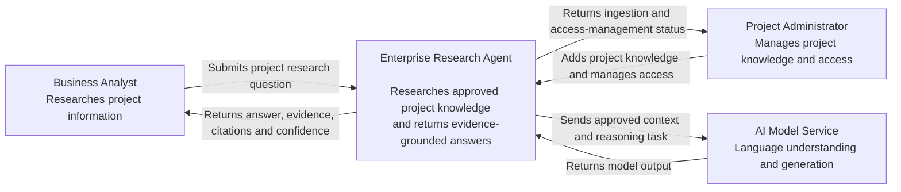

# Enterprise Research Agent — System Context

## 1. Purpose

This document defines the system context and external boundaries of the Enterprise Research Agent.

The purpose of this document is to establish:

- who interacts with the system,
- what responsibilities belong to the system,
- what responsibilities remain outside the system,
- what external services the system depends on,
- what information crosses system and trust boundaries, and
- which architectural decisions are intentionally deferred to later design phases.

This document represents the highest-level architectural view of the system and does not define internal implementation details such as application frameworks, databases, retrieval technologies, or LangGraph workflow nodes.

---

## 2. System Under Design

### Enterprise Research Agent

The Enterprise Research Agent is a project-scoped research system designed to help authorized enterprise users quickly investigate project-related questions using approved project knowledge.

The system is responsible for:

- accepting natural-language project research questions,
- ensuring the requesting user is authorized to access the requested project,
- researching approved project knowledge,
- evaluating whether available evidence is sufficient,
- identifying conflicting or incomplete information,
- producing evidence-grounded answers,
- returning traceable source references,
- providing an evidence-based confidence indication, and
- maintaining enough execution information to support investigation and audit.

The system is intended to assist human decision-making. It does not act as the authoritative decision-maker for project, business, legal, financial, or client-facing decisions.

---

## 3. Actors

### 3.1 Business Analyst

The Business Analyst is the primary user of the system.

#### Responsibilities

The Business Analyst uses the Enterprise Research Agent to research project-related information and understand project context.

#### Typical Interactions

The Business Analyst may:

- submit natural-language project questions,
- research historical decisions,
- investigate requirement changes,
- understand release delays,
- prepare for client or project meetings,
- inspect supporting evidence,
- review conflicting information, and
- determine when available project knowledge is insufficient.

#### Inputs

- Project-scoped research question

#### Outputs

- Evidence-grounded answer
- Supporting source references
- Confidence indication
- Conflicting-information warning where applicable
- Insufficient-evidence warning where applicable

---

### 3.2 Project Administrator

The Project Administrator is the secondary user of the system.

#### Responsibilities

The Project Administrator manages project knowledge and user access to project information.

#### Typical Interactions

The Project Administrator may:

- add project documents,
- update project knowledge,
- manage document metadata,
- grant users access to projects,
- revoke user access to projects,
- review document versions, and
- identify superseded or outdated project information.

#### Inputs

- Project documents
- Document metadata
- Project membership changes
- User access changes

#### Outputs

- Document ingestion status
- Project-access management status
- Document/version information

---

## 4. External Systems

### 4.1 AI Model Service

The AI Model Service provides language understanding and generation capabilities required by the Enterprise Research Agent.

The exact provider or hosting model is intentionally not defined at this stage.

Possible future implementations may include:

- a managed external AI provider,
- an enterprise-hosted model,
- a cloud-hosted private model, or
- a locally hosted model.

The Enterprise Research Agent remains responsible for determining what information is permitted to be sent to the model service.

The AI Model Service is not responsible for:

- user authorization,
- project access decisions,
- determining authoritative enterprise facts,
- calculating final evidence-based confidence, or
- deciding which project information a user is allowed to access.

---

## 5. System Boundary

### 5.1 Responsibilities Inside the Enterprise Research Agent

The Enterprise Research Agent owns the following responsibilities:

- project-scoped research request handling,
- project-access enforcement,
- project knowledge management,
- project document ingestion,
- project knowledge retrieval,
- evidence evaluation,
- additional research orchestration,
- conflict detection,
- grounded answer generation,
- citation management,
- evidence-based confidence calculation,
- execution trace generation, and
- response delivery to authorized users.

---

### 5.2 Responsibilities Outside the Enterprise Research Agent

The Enterprise Research Agent does not own:

- the original authoritative enterprise source systems,
- external AI model infrastructure,
- enterprise identity infrastructure,
- business or client decisions made using system output,
- Jira, GitHub, Confluence, Slack, Teams, or similar enterprise systems in the initial version,
- organization-wide policy management, or
- continuous synchronization with external enterprise platforms.

The initial implementation uses explicitly added project knowledge rather than continuously reading from enterprise source systems.

---

### 5.3 Authoritative Data Ownership

The Enterprise Research Agent may store, index, transform, or process approved copies of project documents for research purposes.

However, the research system does not automatically become the authoritative owner of the original project information.

For example:

- an approved requirement document may remain authoritative in the organization's document-management process,
- a release decision may remain authoritative in an approved project record, and
- the Enterprise Research Agent may maintain a searchable representation of that information for research.

This distinction is important because indexed research data may become outdated if the original enterprise source changes.

---

## 6. System Interactions

| Source | Destination | Information | Purpose |
|---|---|---|---|
| Business Analyst | Enterprise Research Agent | Natural-language research question | Research approved project knowledge |
| Enterprise Research Agent | Business Analyst | Answer, evidence, citations, confidence and warnings | Provide an explainable research result |
| Project Administrator | Enterprise Research Agent | Project documents and metadata | Maintain project knowledge |
| Project Administrator | Enterprise Research Agent | Project membership and access changes | Control access to project information |
| Enterprise Research Agent | Project Administrator | Ingestion and access-management status | Confirm administrative operations |
| Enterprise Research Agent | AI Model Service | Approved research task and permitted context | Perform language understanding or generation |
| AI Model Service | Enterprise Research Agent | Model output | Support the research workflow |

---

## 7. C4 System Context Diagram

### Diagram Interpretation

The diagram intentionally treats the Enterprise Research Agent as one system.

Internal implementation details such as APIs, databases, retrieval modules, LangGraph workflows, and storage components are not shown at this level.

Those components will be introduced in lower-level architecture views.

---

## 8. Trust Boundaries

### TB-001 — User Input Boundary

Information submitted by a user must be treated as untrusted input.

The system must validate incoming requests before processing them.

User-provided content must never be allowed to bypass authorization or project-isolation controls.

---

### TB-002 — Project Authorization Boundary

Project authorization must be enforced using deterministic application logic before restricted project information becomes available to the research workflow.

The AI model must not be responsible for deciding whether a user is authorized to access a project.

A research request for Project A must not retrieve information belonging exclusively to Project B unless the requesting user is explicitly authorized for both and the research scope allows it.

---

### TB-003 — AI Model Boundary

Information sent from the Enterprise Research Agent to an AI Model Service crosses a system trust boundary.

Before project information is transmitted, the architecture must account for:

- enterprise privacy requirements,
- client confidentiality,
- data-retention policies,
- provider data-handling guarantees,
- regulatory requirements where applicable, and
- deployment model.

The model service must receive only the information necessary for the permitted research task.

---

### TB-004 — Administrative Boundary

Project-administration actions such as adding project knowledge or changing user access have a higher privilege level than normal research operations.

Only authorized administrative users may perform these operations.

---

## 9. Scope Notes

### Initial Scope

The initial version is project-scoped.

It focuses on:

- Business Analyst research use cases,
- explicitly uploaded textual project documents,
- project-based access control,
- evidence-grounded question answering,
- source traceability,
- insufficient-evidence handling,
- conflicting-evidence handling, and
- research execution visibility.

### Future Evolution

The architecture may later evolve to support:

- multiple projects per organization,
- organization-wide research,
- company policies,
- HR or operational knowledge,
- Jira,
- GitHub,
- Confluence,
- Slack,
- Microsoft Teams,
- Google Drive,
- MCP-based integrations,
- enterprise SSO,
- automated knowledge synchronization, and
- additional enterprise knowledge domains.

These capabilities are intentionally outside the initial implementation boundary.

---

## 10. Decisions Deferred to Later Architecture Phases

The following decisions are intentionally deferred because the system-context view does not require implementation-level technology choices.

### Application Architecture

- Backend framework
- Frontend framework
- Internal module boundaries
- Modular-monolith structure
- API design

### AI Orchestration

- Whether LangGraph is used
- Graph state structure
- Workflow nodes
- Conditional edges
- retry behavior
- human-in-the-loop behavior
- checkpointing strategy

### Data and Retrieval

- Relational database technology
- Vector-search technology
- embedding provider
- chunking strategy
- ranking strategy
- evidence-scoring strategy

### AI Model Infrastructure

- LLM provider
- model selection
- local versus hosted model
- fallback-provider strategy

### Infrastructure

- deployment platform
- containerization strategy
- background job infrastructure
- caching
- scaling strategy
- observability tooling

### Security

- authentication implementation
- enterprise SSO
- authorization data model
- encryption implementation
- secret-management solution

These decisions will be made in later architecture phases after the required responsibilities, system boundaries, and runtime behavior are understood.

---
